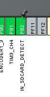
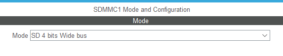
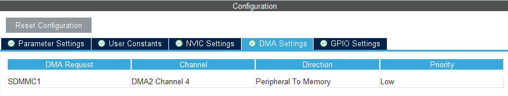
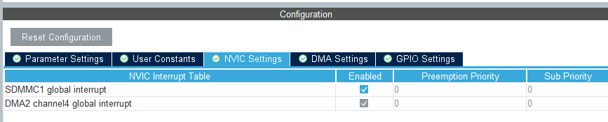
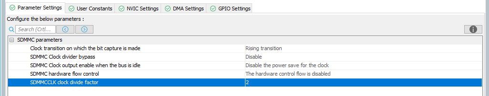
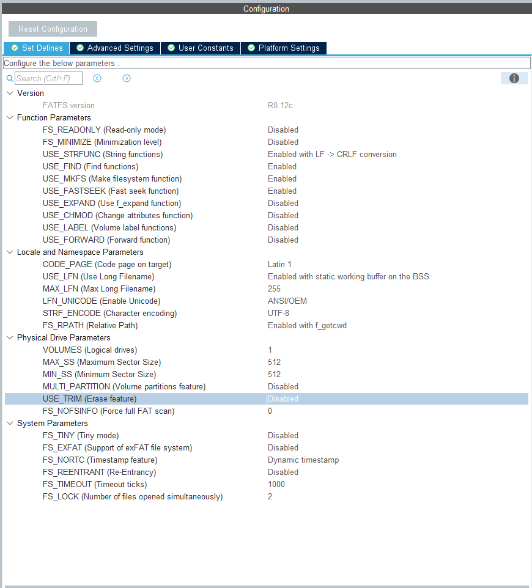
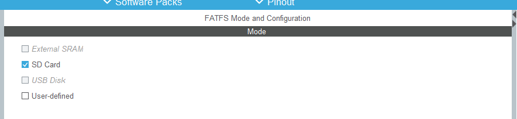
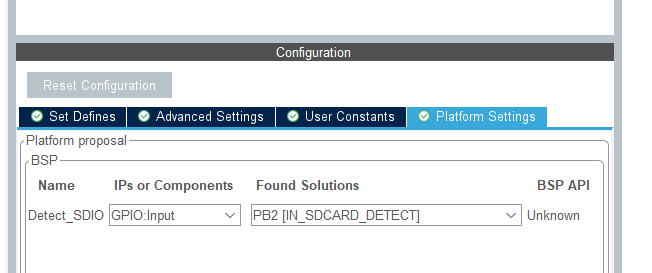
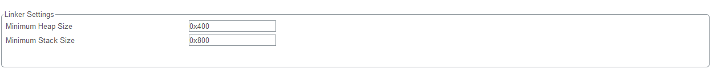
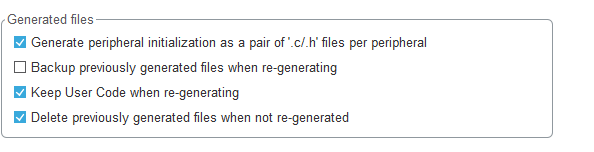

# Carte SD avec FATFS Example

## Introduction

Exemple de carte sd en mode 4 bit bus ( plus rapide que SPI)

### Comportement de l'exemple

Écriture d'un fichier texte sur la carte SD.  Fonction avec interuption et DMA

## Requis matériel

Dev board NUCLEO L496ZG-P

### Compatibilité

#### Matériel supporté

##### ST boards

- Développé et testé sur le NUCLEO L496ZG-P


## Requis logiciels

- Développé avec STM32CubeIDE - Version: 1.8.0
  Build: 11526_20211125_0815 (UTC)
- Configuration du projet fait avec Stm32 Cube MX - Version: 6.4.0-RC4
  Build: 20211122-2105 (UTC)

### Librairies requises

- aucune


## Démarrage

###  STM32 L4 Nucleo

   1. Brancher board nucleo USB ( en utilisant le connecteur CN1)
   2. Ouvrir le projet avec STM32 Cube IDE
      3. Programmer le code

#### Hardware setup

| Pin  | Connecteur | Nom  | Description      |
| ---- | ---------- | ---- | ---------------- |
| 3.3V | CN8-7      | 3.3V |                  |
| GND  | CN8-11     | GND  |                  |
| PC8  | CN8-2      | D0   |                  |
| PC9  | CN8-4      | D1   |                  |
| PC10 | CN8-6      | D2   |                  |
| PC11 | CN8-8      | D3   |                  |
| PC12 | CN8-10     | clk  |                  |
| PD2  | CN8-12     | CMD  |                  |
| PB2  | CN9-13     | CD   | IN_SDCARD_DETECT |


##### Pour plus de détails


### Mise en place

#### Étape 1: Configurer le périphérique dans CUBEMX  

##### Configuration du GPIO pour al déctectiond e la carte SD




##### Configuration du mode SDMMC 

​	 Dans Connectivity / SDMMC1

1. Choisir le mode "4 bits wide bus"

   

   2. Config DMA

      

   3. Activer les interruptions

      

      4. [Optionnel / par projet] Ajustement de la fréquence de communication
   
         La fréquence de communication de la carte SD est relativement rapide par défaut (0). Si votre projet utilise des plaquettes de prototypage avec de long fils, il y de grande chance que des erreurs de communication soit présente.  Vous pouvez donc monter la valeur du diviseur pour réduire fréquence de communication.   
      
         
      
      
      
      

##### 	Configuration du FATFS

​		Dans Middleware / FATFS










##### Dans le Project Manager, on doit changer la taille du heap et du stack 



 Optionnel:  généré tous les périphériques dans des .c/.h séparés ( plsu propore)




#### Étape 2: Mise en place du code 

##### Création des fonction de config pour Tx et Rx

Main.c, dans la section /* PFP */

```c++
/* USER CODE BEGIN PFP */
    //Create config functions for rx and tx dma
    static HAL_StatusTypeDef SD_DMAConfigRx(SD_HandleTypeDef *hsd);
    static HAL_StatusTypeDef SD_DMAConfigTx(SD_HandleTypeDef *hsd);
    /* USER CODE END PFP */
```

Ces fonctions seront appelées à chaque tx/rx pour configurer le DMA en mode réception ou transmission

dans la section /* USER CODE 4 */

```c++
 /* USER CODE BEGIN 4 */
    
    /**
      * @brief Configure the DMA to receive data from the SD card
      * @retval
      *  HAL_ERROR or HAL_OK
      */
    static HAL_StatusTypeDef SD_DMAConfigRx(SD_HandleTypeDef *hsd)
    {
      static DMA_HandleTypeDef hdma_rx;
      HAL_StatusTypeDef status = HAL_ERROR;
    
      /* Configure DMA Rx parameters */
      hdma_rx.Init.Request             = DMA_REQUEST_7;
      hdma_rx.Init.Direction           = DMA_PERIPH_TO_MEMORY;
      hdma_rx.Init.PeriphInc           = DMA_PINC_DISABLE;
      hdma_rx.Init.MemInc              = DMA_MINC_ENABLE;
      hdma_rx.Init.PeriphDataAlignment = DMA_PDATAALIGN_WORD;
      hdma_rx.Init.MemDataAlignment    = DMA_MDATAALIGN_WORD;
      hdma_rx.Init.Priority            = DMA_PRIORITY_VERY_HIGH;
    
      hdma_rx.Instance = DMA2_Channel4;
    
      /* Associate the DMA handle */
      __HAL_LINKDMA(hsd, hdmarx, hdma_rx);
    
      /* Stop any ongoing transfer and reset the state*/
      HAL_DMA_Abort(&hdma_rx);
    
      /* Deinitialize the Channel for new transfer */
      HAL_DMA_DeInit(&hdma_rx);
    
      /* Configure the DMA Channel */
      status = HAL_DMA_Init(&hdma_rx);
    
      /* NVIC configuration for DMA transfer complete interrupt */
      HAL_NVIC_SetPriority(DMA2_Channel4_IRQn, 6, 0);
      HAL_NVIC_EnableIRQ(DMA2_Channel4_IRQn);
    
      return (status);
    }
    
    /**
      * @brief Configure the DMA to transmit data to the SD card
      * @retval
      *  HAL_ERROR or HAL_OK
      */
    static HAL_StatusTypeDef SD_DMAConfigTx(SD_HandleTypeDef *hsd)
    {
      static DMA_HandleTypeDef hdma_tx;
      HAL_StatusTypeDef status;
    
      /* Configure DMA Tx parameters */
      hdma_tx.Init.Request             = DMA_REQUEST_7;
      hdma_tx.Init.Direction           = DMA_MEMORY_TO_PERIPH;
      hdma_tx.Init.PeriphInc           = DMA_PINC_DISABLE;
      hdma_tx.Init.MemInc              = DMA_MINC_ENABLE;
      hdma_tx.Init.PeriphDataAlignment = DMA_PDATAALIGN_WORD;
      hdma_tx.Init.MemDataAlignment    = DMA_MDATAALIGN_WORD;
      hdma_tx.Init.Priority            = DMA_PRIORITY_VERY_HIGH;
    
      hdma_tx.Instance = DMA2_Channel4;
    
      /* Associate the DMA handle */
      __HAL_LINKDMA(hsd, hdmatx, hdma_tx);
    
      /* Stop any ongoing transfer and reset the state*/
      HAL_DMA_Abort(&hdma_tx);
    
      /* Deinitialize the Channel for new transfer */
      HAL_DMA_DeInit(&hdma_tx);
    
      /* Configure the DMA Channel */
      status = HAL_DMA_Init(&hdma_tx);
    
      /* NVIC configuration for DMA transfer complete interrupt */
      HAL_NVIC_SetPriority(DMA2_Channel4_IRQn, 6, 0);
      HAL_NVIC_EnableIRQ(DMA2_Channel4_IRQn);
    
      return (status);
    }
```


Aussi dans la section /* User code 4 */ on créer une fonction pour surcharger les fonctions BSP poru el tc et Rx

```c++
//Override DMA write functions
uint8_t BSP_SD_WriteBlocks_DMA(uint32_t *pData, uint32_t WriteAddr, uint32_t NumOfBlocks)
{
  uint8_t sd_state = MSD_OK;

  // Invalidate the dma rx handle
  hsd1.hdmarx = NULL;

  // Prepare the dma channel for a read operation
  sd_state = SD_DMAConfigTx(&hsd1);

  if(sd_state == HAL_OK)
  {
    /* Write block(s) in DMA transfer mode */
    sd_state = HAL_SD_WriteBlocks_DMA(&hsd1, (uint8_t *)pData, WriteAddr, NumOfBlocks);
  }

  if( sd_state == HAL_OK)
  {
    return MSD_OK;
  }
  else
  {
    return MSD_ERROR;
  }

  return sd_state;
}

//Override DMA read functions
uint8_t BSP_SD_ReadBlocks_DMA(uint32_t *pData, uint32_t ReadAddr, uint32_t NumOfBlocks)
{
  uint8_t sd_state = MSD_OK;
  /* Invalidate the dma tx handle*/
  hsd1.hdmatx = NULL;

  /* Prepare the dma channel for a read operation */
  sd_state = SD_DMAConfigRx(&hsd1);

  if(sd_state == HAL_OK)
  {
       /* Read block(s) in DMA transfer mode */
        sd_state = HAL_SD_ReadBlocks_DMA(&hsd1, (uint8_t *)pData, ReadAddr, NumOfBlocks);
  }

  if( sd_state == HAL_OK)
  {
    return MSD_OK;
  }
  else
  {
    return MSD_ERROR;
  }
}
```


##### Modification des interruptions

dans stm32l4xx_it.c, modifier la fonction DMA2_Channel4_IRQHandler

```c++
/**
  * @brief This function handles DMA2 channel4 global interrupt.
  */
void DMA2_Channel4_IRQHandler(void)
{
  /* USER CODE BEGIN DMA2_Channel4_IRQn 0 */

  /* USER CODE END DMA2_Channel4_IRQn 0 */
    //DMAFIX comment or delete HAL_DMA_IRQHandler(&hdma_sdmmc1); //Note: recommenter à chaques regénération
  /* USER CODE BEGIN DMA2_Channel4_IRQn 1 */
  //DMAFIX separate irq handler by tx/rx, new code in irq handler
  if((hsd1.Context == (SD_CONTEXT_DMA | SD_CONTEXT_READ_SINGLE_BLOCK)) ||
     (hsd1.Context == (SD_CONTEXT_DMA | SD_CONTEXT_READ_MULTIPLE_BLOCK)))
      {
        //BSP_SD_DMA_Rx_IRQHandler();
       HAL_DMA_IRQHandler(hsd1.hdmarx);

      }
   else if((hsd1.Context == (SD_CONTEXT_DMA | SD_CONTEXT_WRITE_SINGLE_BLOCK)) ||
           (hsd1.Context == (SD_CONTEXT_DMA | SD_CONTEXT_WRITE_MULTIPLE_BLOCK)))
     {
        //BSP_SD_DMA_Tx_IRQHandler();
       HAL_DMA_IRQHandler(hsd1.hdmatx);
     }
  /* USER CODE END DMA2_Channel4_IRQn 1 */
}
```

**Note:**  Chaque fois que le code est regénéré dans CubeMx, on doit retourner commenter la ligne généré automatiquement

HAL_DMA_IRQHandler(&hdma_sdmmc1); 


### Exemple


Inclusion

```
/* USER CODE BEGIN Includes */
#include <string.h>
/* USER CODE END Includes */
```


Variables dans la section User Code 1

```c++
  /* USER CODE BEGIN 1 */
	FRESULT resu; /* FatFs function common result code */
	uint32_t byteswritten;
	uint8_t wtext[] = "Ceci est un exemple d'écriture sur une carte SD!"; /* File write buffer */
	uint8_t rtext[_MAX_SS];/* File read buffer */
  /* USER CODE END 1 */
```


code de test dans la section User code 2

```c++
/* USER CODE BEGIN 2 */

  resu = f_mount(&SDFatFS, (TCHAR const*)SDPath, 1);
  if( resu != FR_OK)
  	{
  		//Error_Handler();
	  	if(resu == FR_NO_FILESYSTEM)
	  	{
	  		resu = f_mkfs((TCHAR const*)SDPath, FM_FAT32, 0, rtext, sizeof(rtext));
			if( resu != FR_OK)
			{
				Error_Handler();
			}
	  	}
	  	else
	  	{
	  		Error_Handler();
	  	}

  	}

		resu = f_mount(&SDFatFS, (TCHAR const*)SDPath, 1);
		if(resu != FR_OK)
		{
			Error_Handler();
		}
		else
		{
			//Open file for writing (Create)
			resu = f_open(&SDFile, "STM32.TXT", FA_CREATE_ALWAYS | FA_WRITE);
			if( resu != FR_OK)
			{
				Error_Handler();
			}
			else
			{
				//HAL_GPIO_WritePin(OUT_D0_GPIO_Port, OUT_D0_Pin, 1); // Utiliser pour mesure le temps d'execution avec un analyseur logique
				//Write to the text file
				resu = f_write(&SDFile, wtext, strlen((char *)wtext), (void *)&byteswritten);

				//HAL_GPIO_WritePin(OUT_D0_GPIO_Port, OUT_D0_Pin, 0); // Utiliser pour mesure le temps d'execution avec un analyseur logique

				if((byteswritten == 0) || (resu != FR_OK))
				{
					Error_Handler();
				}
				else
				{
					f_close(&SDFile);
				}
			}

			f_mount(&SDFatFS, (TCHAR const*)NULL, 0); // unmount
		}

  /* USER CODE END 2 */
```

